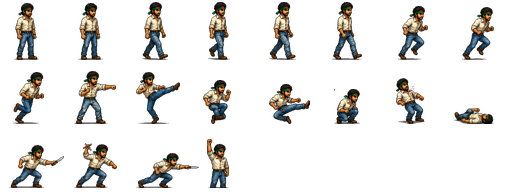

# March to Ganabhaban · গণভবন অভিমুখে যাত্রা

A belt-scroll arcade brawler about the Bangladesh July 2024 uprising, written in
C++17 with [raylib](https://www.raylib.com/). Four stages, five bosses, two
allies who can be lost for good, and an ending where the final boss does not die
— she leaves.

Rendered at **384×224**, the native resolution of Capcom's CPS-1 arcade board.
Runs natively on Windows and compiles to WebAssembly for phones at ~3 MB.

All in-game text is Bangla.


---

## Contents

- [Build and run](#build-and-run)
- [Controls](#controls)
- [How it plays](#how-it-plays)
- [Architecture](#architecture)
- [Three problems worth reading about](#three-problems-worth-reading-about)
- [Rebalancing](#rebalancing)
- [Art pipeline](#art-pipeline)
- [Testing](#testing)
- [Web build](#web-build)
- [Project layout](#project-layout)

---

## Build and run

raylib is vendored pre-compiled, so there is no install step:

```sh
mingw32-make run
```

Requires MinGW-w64 GCC (tested on 14.2.0, UCRT). `vendor/raylib` holds the
headers and `libraylib.a`; the raylib *source* is not committed — see
[Web build](#web-build) if you need to rebuild the library.

---

## Controls

| Action | Keyboard | Touch |
|---|---|---|
| Move — 8 directions | Arrows / WASD | left thumb pad |
| Punch — three-hit combo | `J` / `Z` | **HIT** |
| Jump — `J` in the air is a jump kick | `K` / `X` | **JUMP** |
| Run | double-tap left or right | double-tap the pad |
| Reload art without rebuilding | `R` | — |

Touch controls appear the first time the screen is touched, so they never
clutter a keyboard session.

---

## How it plays

### Gameplay demo

[](https://github.com/Nafis1e18/march-to-ganabhaban/raw/refs/heads/main/assets/Vedio/readme_final_gameplay.mp4)

*Short animated preview — click it to watch the full gameplay video.*

### Example character: Rebel



Each cell is one animation frame. The engine combines these frames into idle,
walking, running, punching, kicking, jumping, hurt, and knockdown animations.

**The belt.** Every fighter has three coordinates: `x` along the street, `z` for
depth up and down the road, `y` for jump height. You can only strike someone at
a similar `z`. That one rule is what separates a brawler from a side-scroller,
and it is why a bullet can be dodged by stepping into another lane instead of
jumping.

**Camera locks.** When a wave triggers the camera stops and will not move on
until the street is clear. Then **এগিয়ে চলো** appears.

**Two allies.** Jitu and Antor fight beside you, pick their own targets and draw
enemy attention. They are deliberately fragile. When one runs out of health he
drops where he stands, his body stays there, and **he does not come back for the
rest of the run.** Lose both early and you finish alone.

**Difficulty.** Two modes chosen at the start. Easy gives each ally one revive
and you three lives; Medium gives allies none and you two, and raises enemy
health, damage, speed, and how many may attack at once.

### The stages

| # | Stage | Enemies | Boss |
|---|---|---|---|
| 1 | শাহবাগ | Chhatra League | সভাপতি সাদ্দাম |
| 2 | উত্তরা | + riot police, DB Harun | ডিবি হারুন |
| 3 | রামপুরা | + Jallad | কাউয়া কাদের |
| 4 | গণভবন | everything | **শেখ হাসিনা + জল্লাদ** |

**DB Harun** hangs back at a firing distance instead of closing in, stops,
raises the pistol for 34 frames with a red line down your lane, and fires. That
telegraph is the whole fight — jump it or change lane.

**Jallad** has super armour: he keeps swinging through your punches, so he
cannot be stunlocked the way a Chhatra League cadre can.

**Hasina never dies.** At 5% health she stops fighting, a helicopter drops in,
she runs to it, and it lifts away. The ending is a flight, not a kill.


---

## Architecture

```
src/game.h      types, belt geometry, animation tables, combat frame data
src/stages.h    ALL balance: enemy stats, waves, stages, difficulty modes
src/main.cpp    state machine, wave flow, AI, player control
src/render.cpp  parallax backgrounds, particles, placeholder skeleton renderer
src/sprites.cpp sprite sheets with per-animation fallback
src/text.cpp    Bangla UI (pre-shaped PNGs)
src/audio.cpp   synthesised gameplay audio + the final victory recording
```

Everything is **frame-counted at a locked 60fps**, never delta-timed. A move
that is "13 frames" is 13 frames on every machine. Delta-timed combat feels
different on every laptop.

The art, the animation table and the hitboxes are **three separate things** —
the same separation Capcom used. A drawing is a pose; how long that pose is held
is data; where it hurts is different data again.

---

## Three problems worth reading about

These were the genuinely hard parts, and the solutions are the interesting code.

### 1. raylib cannot render Bangla

raylib draws glyphs one codepoint at a time with no shaping. Bengali needs
matra reordering (the vowel in **কি** is stored after its consonant but drawn
before it) and conjunct joining (**ক** + **্** + **ত** → **ক্ত**). Rendered
naively it comes out scrambled.

Every string is pre-shaped by Windows DirectWrite and baked to a PNG
(`tools/make_bangla.ps1`), which the game blits. Two details matter:

- Strings are rendered **4× oversized** and scaled down. Baked at final size,
  Bengali matras are a single pixel and no amount of scaling recovers them.
- Text is drawn **after** the world is upscaled, at window resolution. Drawing
  it into the 384×224 buffer and then blowing that buffer up resamples the
  glyphs twice and turns them to mush.

Edit the Bangla in `tools/bangla_strings.txt` and re-run the script — no code
changes.

### 2. Hand-drawn sheets are not sprite sheets

Character art arrives as one big image of labelled poses on a white background.
`tools/extract_sprites.py` turns that into an engine-ready sheet, and three
things make it work:

- **Background removal by saturation, not brightness.** Background pixels are
  neutral (R=G=B); a cream shirt is warm. Keying on brightness would eat the
  shirt.
- **Connected components, not column projection.** A jump-kick's extended leg
  overlaps the x-range of the pose beside it, so no column gap exists to split
  them — but the two drawings never touch.
- **Anchoring on the lower body's centroid, not the bounding box.** Box-centring
  makes the character lurch sideways whenever an arm extends.

### 3. Arcade fairness is one number

Real arcade brawlers hand out a limited number of *attack tokens*; enemies
without one circle and posture instead of swinging. Without it, six enemies
attack simultaneously and the knockback alone is an inescapable stunlock.

That number is `maxAttackers` in `src/stages.h`. It matters more than every
health value in the game combined.

---

## Rebalancing

**Everything is data — never edit the engine to change how the game feels.**

- `src/stages.h` — enemy stats, wave composition, per-stage difficulty, boss
  assignments, the two difficulty modes, scoring.
- `src/game.h` — the player's frame data, belt geometry, jump height, gravity.

Attack frame data reads like this:

```cpp
constexpr AttackDef ATK_PUNCH1 = { 13,  3,  6, 24.f, 12.f,  4, 1.4f, false };
//                        total ─┘   │   │    │     │     │    │      └ knockdown?
//                      start-up ────┘   │    │     │     │    └ knockback
//                    hitbox ends ───────┘    │     │     └ damage
//                            reach in x ─────┘     └ depth tolerance
```

Sluggish punch? Lower `activeFrom`. Whiffing? Raise `reach`.

---

## Art pipeline

```sh
python tools/extract_sprites.py "art_source/raw_drawings/JALLAD.png" "assets/jallad.png"
python tools/prepare_bg.py                              # backgrounds -> parallax layers
python tools/clean_bg_text.py                           # scrub generated gibberish text
powershell -File tools/make_bangla.ps1                  # Bangla UI -> PNGs
python tools/make_sprite_template.py                    # drawing template
```

[ENEMY_ART.md](ENEMY_ART.md) has the 20-pose spec and the prompts that produce
importable sheets. Two rules govern whether a sheet imports cleanly: a **plain
white background**, and **no pure white or grey on the character** (it would be
keyed out — tint light colours warm or cool).

Sheets support **per-animation fallback**: an animation whose frames are not all
drawn falls back to a procedural skeleton renderer, so a half-finished sheet
never breaks the build.

`assets/` is ~2.7 MB and is the entire game download. The 36 MB of source
artwork lives in `art_source/` and is never shipped.

---

## Testing

The game plays itself, which is how every balance claim here was checked:

```sh
build/game.exe --demo --debug --fast --diff 1
```

| Flag | Effect |
|---|---|
| `--demo` | bot plays: closes on the nearest enemy, lines up the lane, swings |
| `--diff N` | 0 = Easy, 1 = Medium |
| `--god` | keeps health topped up, to reach late stages |
| `--debug` | overlays flow state and logs every transition to stdout |
| `--fast` | uncaps the framerate — a full run takes seconds |
| `--stage N` | start on stage N |
| `--boss` | skip the waves, straight to the boss |
| `--shot N FILE` | capture frame N and exit |

Because combat is frame-counted, `--fast` changes how long a test takes but
never how the game plays. A verified run:

```
f40     PLAY     stage1 wave0/3 boss0 lives3 score0
f4321   CLEAR    stage1 wave3/3 boss1 lives2 score6530
f13494  CLEAR    stage2 wave3/3 boss1 lives2 score24850
f27309  CLEAR    stage3 wave3/3 boss1 lives2 score63190
f48764  CLEAR    stage4 wave3/3 boss1 lives2 score110140
```

---

## Web build

One-time setup:

```sh
git clone https://github.com/emscripten-core/emsdk vendor/emsdk
cd vendor/emsdk && python emsdk.py install latest && python emsdk.py activate latest

# raylib source is not committed; fetch it and build the web library
curl -L -o raylib.zip https://github.com/raysan5/raylib/archive/refs/tags/6.0.zip
# unzip to vendor/raylib-src, then:
cd vendor/raylib-src/src && mingw32-make PLATFORM=PLATFORM_WEB -B
```

Then:

```sh
mingw32-make web
python -m http.server 8000 --directory build/web
```

Output is ~3 MB. Serve it — do not open `index.html` directly, the browser
blocks the WASM fetch over `file://`.

---

## Project layout

```
src/          engine and game (~2,400 lines of C++)
assets/       what ships: sprite sheets, background layers, Bangla text (~2.7 MB)
art_source/   original artwork and drawing templates — never shipped (~36 MB)
tools/        asset pipeline: sprite extraction, background prep, Bangla rendering
vendor/       raylib headers + prebuilt static library
docs/         screenshots
```

---

## Credits

Original pixel artwork and character design by **Nafis Ahmed**, with the
protagonist and his two allies drawn from life.

Built for a July 2026 hackathon commemorating the 2024 uprising.
